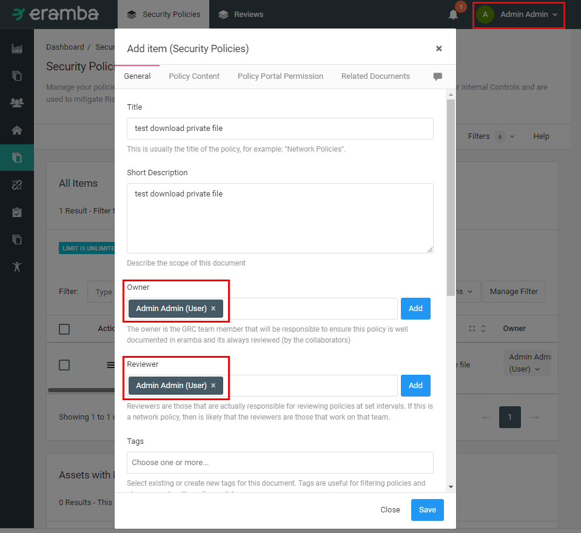
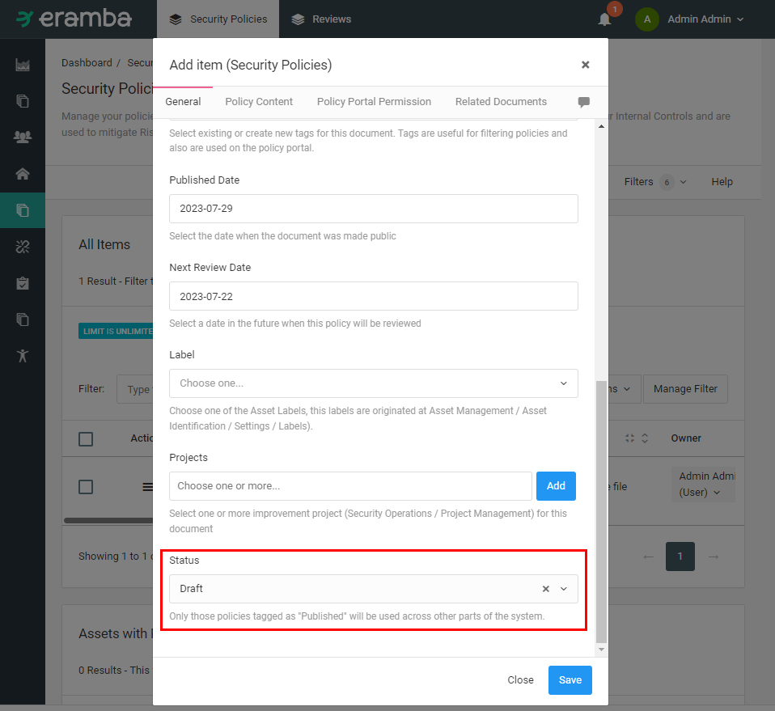
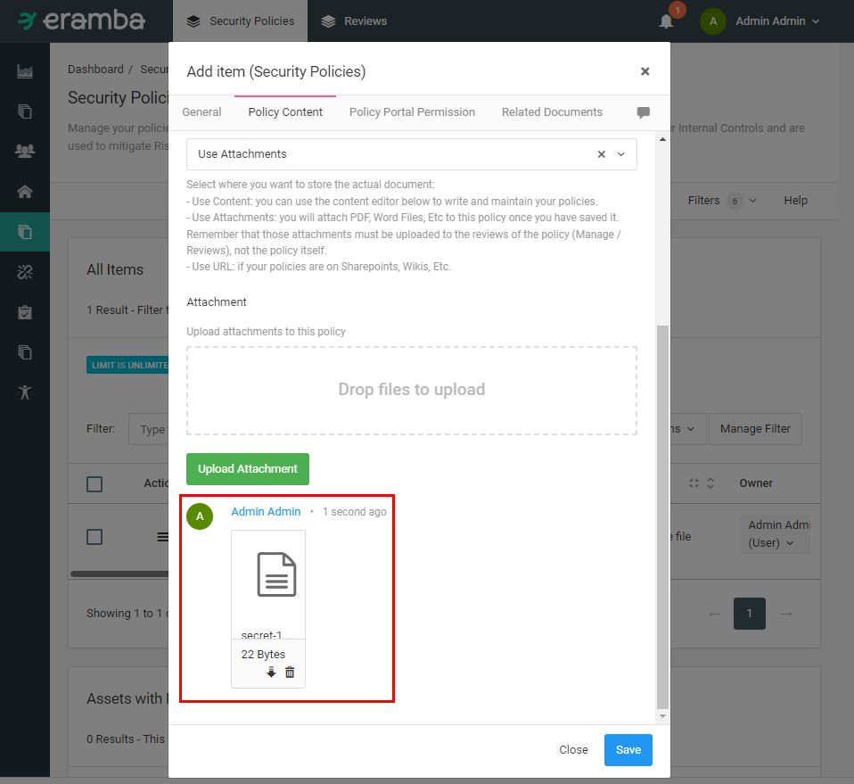
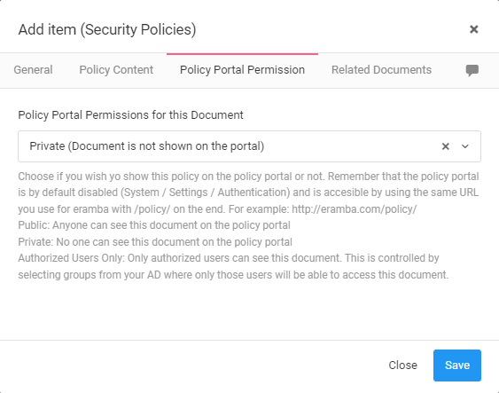
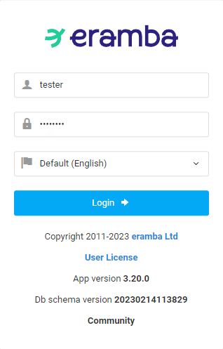
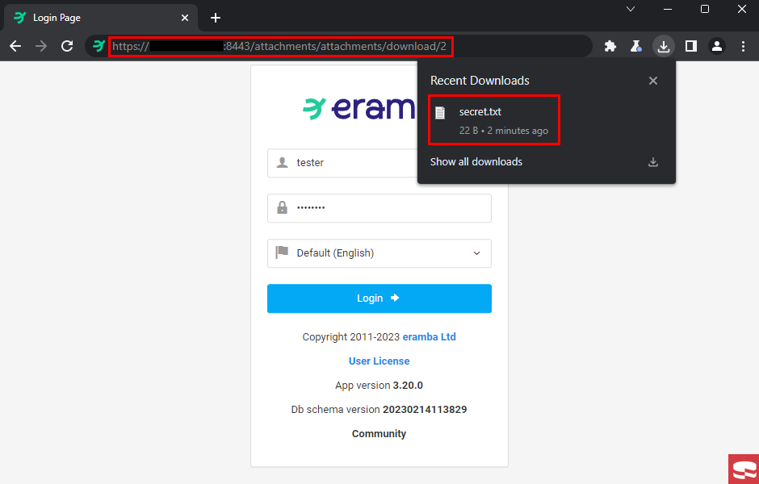
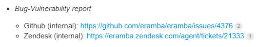

# CVE-2024-34829: IDOR in Eramba Community version <3.22.0

## Issue Summary
An IDOR bug was found on `/attachments/attachments/download/` API allows abitrary file download, as a result of lacking of user permission control.

## Issue Impact
All existing files in a section, including private files belonging to the admin user, can be downloaded. Any user who has the Download Attachments option enabled in that section can perform this action. Consequently, this bug has an impact on user privacy and data security.

## Proof of Concept

### Using admin account

Admin created new policy

Set the Status to Draft, which means this policy was not currently in use

Uploaded secret.txt file

Set Private mode to hide the document on the portal

### Using tester account

Logged in to the tester account on the Eramba server. Note that this account is only in the "All but settings" group and not in the "Admin" group.

Accessed `https://[redacted]:8443/attachments/attachments/download/{file_id}` to download file. Since `{file_id}` increases linearly, it was easy to predict the paths of the other files.  
In this case, the `{file_id}` was `2`

## Disclosure Timeline for CVE-2024-34829
- 07/15/23: Vulnerability discovered
- 07/21/23: Vulnerability reported to Eramba
- 07/24/23: Eramba opened the ticket https://github.com/eramba/eramba/issues/4376
- 10/23/23: Patch provided by Eramba in version 3.22.0
- 05/01/24: Writeup published and CVE Requested
- 05/14/24: CVE-2024-34829 assigned

## References
Eramba Changelog: https://discussions.eramba.org/t/release-3-22-0/3658

